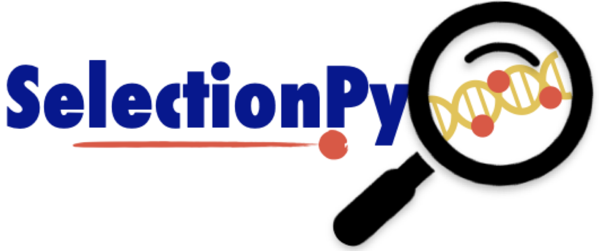

----------------------------------

### About
SelectionPy is a python application (script for now) to estimate the non-synonymous to synonymous rate ratio (dN/dS) of all protein-coding genes in a genome. SelectionPy aims to allow users to analyse dN/dS quickly and easily. 

### Dependencies
- Python version > 3
- Biopython
- Pandas library
- BLAST 2.13.0+
- Muscle version > 5 (be sure to name the execution file as `muscle` and add it to the `PATH`)
- IQ-TREE version 1.6.12 (be sure to name the execution file as `iqtree` and add it to the `PATH`)
- pal2nal
- codeml

For now, the dependencies need a manual installation, but I'm working in a __Docker__ container.

### Test it

```shell
git clone https://github.com/sebametz/SelectionPy.git
cd SelectionPy
```
```shell
python selectionPy.py -i /home/user/Documents/SelectionPy/test -r organismsA.fasta --threads 4
```

The results of the analysis are in `./test/reports`

### Run with your data

Before executing script `selectionPy.py`, be sure that in your working directory, the genomes have the extension **.fasta** and the annotation **.gff**.

For example: 

/home/user/working_directory `files`:

- StrainA<spam>**.fasta**</span> 
- StrainB<spam>**.fasta**</span> 
- StrainA<spam>**.gff**</span> 
- StrainB<spam>**.gff**</span>

```shell
python selectionPy.py -i /home/user/working/directory -r strainA.fasta --threads 4
```

### To do list

I wrote this script in the last couple of days, so there is much to do.
- Test with multiple genomes; I only tested it with two genomes.
- Add analysis with KaKs_Calculator 2.0 to validate CODEML results.
- Optimise configuration files for MUSCLE, IQ-TREE and CODEML.
- Create a user interfase with Tk.
- Create a Docker container to solve dependencies.

### Contact information

Sebastian Metz: seba.metz91@gmail.com